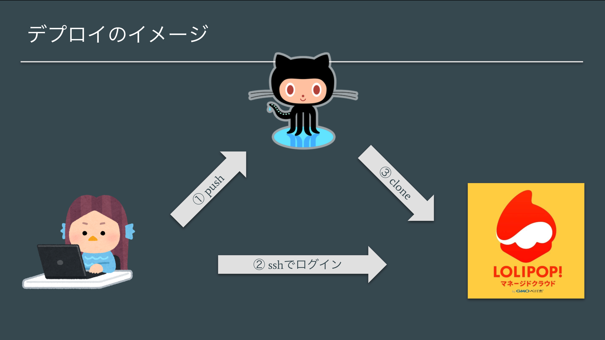

# デプロイの概要

## デプロイ概略図

実装したプロジェクトを GitHub に push し，デプロイ先のサーバ（マネージドクラウド）にログインして GitHub 上のプロジェクトを clone(or pull)することでデプロイを実現する．

### 💡 Key Point

> 下記パターンの操作環境があるので，都度正しい操作環境で操作しているかどうかを確認すること．
>
> - ブラウザ
> - ローカル PC のターミナル
> - マネージドクラウド

## マネクラでプロジェクトを作成する．

> ブラウザでの操作

マネクラに登録してプロジェクトを作成しておく．PHP を選択し，プロジェクト名は任意に設定．

登録したらプロジェクトページを開いておくと良い．
