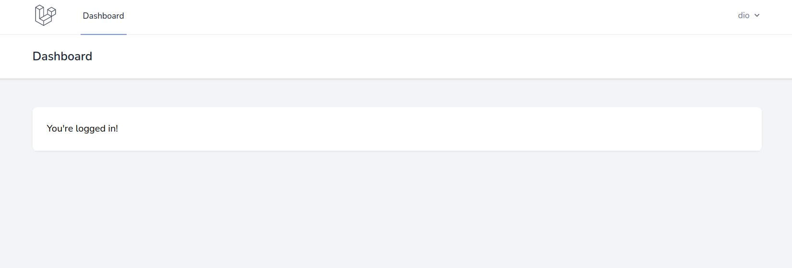

# マイグレーションによるテーブル作成

プロダクトの実装を進める上で，Laravel コンテナ内や DB コンテナ内など「実行場所」を確認すること．

## テーブル設計（マイグレーションファイル）

<!-- > **📦 Laravel コンテナ内の操作**
>
> ```bash
> $ docker-compose exec laravel.test bash
> root@8544d96d2334:/var/www/html#
> ``` -->

今回のアプリケーションは twitter ライクな SNS なので「tweets」テーブルを作成する．

Laravel では「マイグレーション」という仕組みを使用してテーブルの管理を行う．また，テーブル内のデータは「Model」を使用して操作する．Laravel では`Eroquent Model`と呼ばれる ORM を使用する．

> 【解説 / マイグレーション】
>
> - マイグレーションとは「マイグレーションファイル」を用いてテーブルを管理する仕組み．
> - 「マイグレーションファイル」にテーブル名やカラム名を記述し，指定されたコマンドを実行することで設定したテーブルが生成される．

> 【解説 / Eloquent Model】
>
> - Eloquent Model は Laravel 標準の ORM（object-relational mapper）である．
> - ORM とは，DB のレコードをオブジェクトとして直感的に扱えるようにしたもので，SQL を意識せずにプログラムで処理を記述することができる．
> - Eloquent Model は定義された「Model」を用いることで簡単に DB へのデータ保存・取得などを行える．
> - 1 つのモデルが 1 つのテーブルに対応する．例えば，`tweets`テーブルに対して`Tweet`のようにモデルを定義すると自動的に対応する．モデル内に明示的に対応を記述することもできる．
> - テーブルに対してデータ操作を行う場合，対応するモデルに対して処理を実行することで DB 操作を行うことができる．

Model とマイグレーションファイルは一度に両方とも作成することができる．

下記コマンドは Model を作成するコマンドだが（`Tweet`がモデル名），`-m`をつけることでマイグレーションファイルも同時に作成できる．この手法を用いることで，Model 名とマイグレーションファイル内のテーブル名が自動的に対応する．

早速実行．

```bash
$ php artisan make:model Tweet -m

# 実行結果（日付時刻は毎回変わる）
Model created successfully.
Created Migration: 2021_09_23_130915_create_tweets_table

```

`database/migration/2021_09_23_130915_create_tweets_table.php`を開く．これがマイグレーションファイルである．

カラムを追加するため，下記にように編集する．今回は`tweet`，`description`の 2 カラムを追加する．

カラムを追加するときはデータ型も設定する．`tweet`は文字列（`string`），`description`はテキスト（`text`）を設定している．

`id`ははじめから用意されているので設定不要．

> 【tips】
>
> - `nullable()`を記述することで，入力必須でなくすることができる．他に`unique()`で重複を禁止することもできる．
> - `timestamps()`は`created_at`カラムと`updated_at`カラムを自動的に設定してくれる．

```php
// database/migrations/2021_09_23_130915_create_tweets_table.php

<?php

use Illuminate\Database\Migrations\Migration;
use Illuminate\Database\Schema\Blueprint;
use Illuminate\Support\Facades\Schema;

class CreateTweetsTable extends Migration
{
  /**
   * Run the migrations.
   *
   * @return void
   */
  public function up()
  {
    Schema::create('tweets', function (Blueprint $table) {
      $table->id();
      // 🔽 ここから追加
      $table->string('tweet');
      $table->text('description')->nullable();
      // 🔼 ここまで追加
      $table->timestamps();
    });
  }

  /**
   * Reverse the migrations.
   *
   * @return void
   */
  public function down()
  {
    Schema::dropIfExists('tweets');
  }
}

```

<!-- ## 【今回は不要】文字列最大長の変更

これでテーブルの設計は完了だが，MySQL のバージョンによってはエラーが発生するため，次の設定を行う．

`app/Providers/AppServiceProvider.php`の内容を以下のように編集する．`string`型の最大長を 191 に変更する．

> 【解説】
>
> - この設定が必要かどうかは MySQL のバージョンによる．MySQL のバージョンが`5.7.7`以下の場合は必要となる．
> - Laravel のマイグレーションでは文字列の最大長が`255`として実行するが，MySQL5.7.7 以下では最大長が`191`となっているためである．

```php
<?php

namespace App\Providers;

use Illuminate\Support\ServiceProvider;
// 🔽  1行追加
use Illuminate\Support\Facades\Schema;

class AppServiceProvider extends ServiceProvider
{
  /**
   * Register any application services.
   *
   * @return void
   */
  public function register()
  {
    //
  }

  /**
   * Bootstrap any application services.
   *
   * @return void
   */
  public function boot()
  {
    // 1行追加
    Schema::defaultStringLength(191);
  }
}
``` -->

## マイグレーション実行

<!-- > 📦 **Laravel コンテナ内の操作**
>
> ```bash
> $ docker-compose exec laravel.test bash
> root@8544d96d2334:/var/www/html#
> ``` -->

マイグレーションを実行するとテーブルが作成される．以下のコマンドを実行する．

```bash
$ php artisan migrate

# 実行結果
Migration table created successfully.
Migrating: 2014_10_12_000000_create_users_table
Migrated:  2014_10_12_000000_create_users_table (88.55ms)
Migrating: 2014_10_12_100000_create_password_resets_table
Migrated:  2014_10_12_100000_create_password_resets_table (90.49ms)
Migrating: 2019_08_19_000000_create_failed_jobs_table
Migrated:  2019_08_19_000000_create_failed_jobs_table (89.10ms)
Migrating: 2019_12_14_000001_create_personal_access_tokens_table
Migrated:  2019_12_14_000001_create_personal_access_tokens_table (155.49ms)
Migrating: 2021_09_23_130915_create_tweets_table
Migrated:  2021_09_23_130915_create_tweets_table (57.06ms)

```

エラーになる場合はマイグレーションファイルの内容が間違っていることが多い．修正して以下のコマンドを実行する．

```bash
$ php artisan migrate:fresh
```

> 【解説】
>
> - `:fresh`をつけることで，存在しているテーブルを一旦削除し，再度マイグレーションを実行することができる．
> - マイグレーションに失敗した場合はエラーが発生するまでに実行された部分はテーブルが作成される．しかし，マイグレーション実行時に，すでに同名のテーブルが存在している場合はエラーになるため，既存テーブルを削除する必要がある．

## テーブル確認

phpmyadmin でテーブルの状況を確認する．`tweets`が以下の内容で作成されていれば OK．

```txt
+-------------+-----------------+------+-----+---------+----------------+
| Field       | Type            | Null | Key | Default | Extra          |
+-------------+-----------------+------+-----+---------+----------------+
| id          | bigint unsigned | NO   | PRI | NULL    | auto_increment |
| tweet       | varchar(191)    | NO   |     | NULL    |                |
| description | text            | YES  |     | NULL    |                |
| created_at  | timestamp       | YES  |     | NULL    |                |
| updated_at  | timestamp       | YES  |     | NULL    |                |
+-------------+-----------------+------+-----+---------+----------------+
```

<!-- 【今回は不要】コマンドで確認する場合は以下の手順で行う．

> 📦 **MySQL コンテナ内の操作**
>
> ```bash
> $ docker-compose exec mysql bash
> root@d984f6614597:/#
> ```

うまくいったら，mysql にログインしてテーブルを確認する．パスワードは`password`．

```bash
$ mysql -u sail -p

mysql> use laratter;
Reading table information for completion of table and column names
You can turn off this feature to get a quicker startup with -A

Database changed

mysql> show tables;
+------------------------+
| Tables_in_laratter     |
+------------------------+
| failed_jobs            |
| migrations             |
| password_resets        |
| personal_access_tokens |
| tweets                 |
| users                  |
+------------------------+
6 rows in set (0.00 sec)

mysql> desc tweets;
+-------------+-----------------+------+-----+---------+----------------+
| Field       | Type            | Null | Key | Default | Extra          |
+-------------+-----------------+------+-----+---------+----------------+
| id          | bigint unsigned | NO   | PRI | NULL    | auto_increment |
| tweet       | varchar(191)    | NO   |     | NULL    |                |
| description | text            | YES  |     | NULL    |                |
| created_at  | timestamp       | YES  |     | NULL    |                |
| updated_at  | timestamp       | YES  |     | NULL    |                |
+-------------+-----------------+------+-----+---------+----------------+
5 rows in set (0.00 sec)

mysql> exit
Bye

``` -->

## テストユーザーデータの作成

<!-- > 📦 **Laravel コンテナ内の操作**
>
> ```bash
> $ docker-compose exec laravel.test bash
> root@8544d96d2334:/var/www/html#
> ``` -->

この段階で，ユーザテーブルなどの認証に使用するテーブルも用意された状態となる．

Laravel には「seeder」という機能があり，テスト用のデータを簡単に作成することができる．

今回はダミーデータを 10 件作成する．`database/seeders/DatabaseSeeder.php`を以下のように編集する．

```php
// database/seeders/DatabaseSeeder.php

<?php

namespace Database\Seeders;

use Illuminate\Database\Seeder;

class DatabaseSeeder extends Seeder
{
  /**
   * Seed the application's database.
   *
   * @return void
   */
  public function run()
  {
    // 🔽 この行のコメントから外す
    \App\Models\User::factory(10)->create();
  }
}

```

下記コマンドを実行してテストユーザを作成する．

```bash
$ php artisan db:seed

# 実行結果
Database seeding completed successfully.

```

コマンドを実行したら phpmyadmin でユーザーデータを確認する．パスワードはハッシュ化されているが全員`password`となっている．

ブラウザの画面からメールアドレスとパスワードでログインできることを確認しよう．

ログインすると，下記の画面が表示される．



> 【tips】
>
> `Email` は `example.com` が使用されている．これはテスト用に用意されているドメインであり，誰かのメールアドレスを使用してしまうリスクを回避できる．
