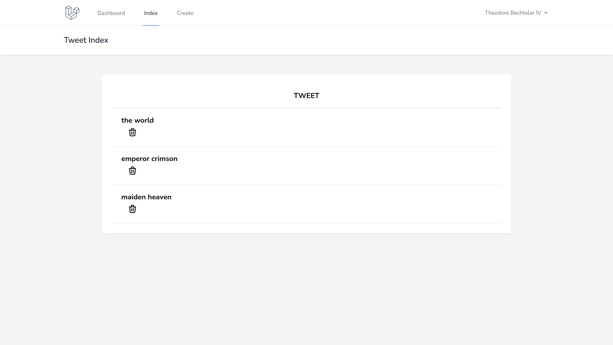

# tweet 削除処理の実装

一覧画面に削除ボタンを設置し，クリックしたら該当するデータを削除できるようにする．

## 一覧画面に削除ボタンを追加

`resources/views/tweet/index.blade.php`を以下のように編集する．

```php
<!-- resources/views/tweet/index.blade.php -->

<x-app-layout>
  <x-slot name="header">
    <h2 class="font-semibold text-xl text-gray-800 leading-tight">
      {{ __('Tweet Index') }}
    </h2>
  </x-slot>

  <div class="py-12">
    <div class="max-w-7xl mx-auto sm:w-10/12 md:w-8/10 lg:w-8/12">
      <div class="bg-white overflow-hidden shadow-sm sm:rounded-lg">
        <div class="p-6 bg-white border-b border-gray-200">
          <table class="text-center w-full border-collapse">
            <thead>
              <tr>
                <th class="py-4 px-6 bg-grey-lightest font-bold uppercase text-lg text-grey-dark border-b border-grey-light">tweet</th>
              </tr>
            </thead>
            <tbody>
              @foreach ($tweets as $tweet)
              <tr class="hover:bg-grey-lighter">
                <td class="py-4 px-6 border-b border-grey-light">
                  <a href="{{ route('tweet.show',$tweet->id) }}">
                    <h3 class="text-left font-bold text-lg text-grey-dark">{{$tweet->tweet}}</h3>
                  </a>
                  <div class="flex">
                    <!-- 更新ボタン -->
                    <!-- 🔽 削除ボタン -->
                    <form action="{{ route('tweet.destroy',$tweet->id) }}" method="POST" class="text-left">
                      @method('delete')
                      @csrf
                      <button type="submit" class="mr-2 ml-2 text-sm hover:bg-gray-200 hover:shadow-none text-white py-1 px-2 focus:outline-none focus:shadow-outline">
                        <svg class="h-6 w-6 text-gray-500" fill="none" viewBox="0 0 24 24" stroke="black">
                          <path stroke-linecap="round" stroke-linejoin="round" stroke-width="1" d="M19 7l-.867 12.142A2 2 0 0116.138 21H7.862a2 2 0 01-1.995-1.858L5 7m5 4v6m4-6v6m1-10V4a1 1 0 00-1-1h-4a1 1 0 00-1 1v3M4 7h16" />
                        </svg>
                      </button>
                    </form>
                  </div>
                </td>
              </tr>
              @endforeach
            </tbody>
          </table>
        </div>
      </div>
    </div>
  </div>
</x-app-layout>

```

> 【解説】
>
> - 削除ボタンクリック時には，コントローラの`destroy()`関数にリクエストが送られる．
> - 削除の処理を行うには`DELETE`メソッドでリクエストを送る必要があるが，form からは GET または POST でしか送れない．
> - `@method('delete')`を記述することで，`DELETE`メソッドで送信できる．

## 動作確認（削除ボタンの設置）

一覧画面を確認し，削除ボタンが表示されていれば OK．



## 指定したデータを削除する処理の作成

まず ID で指定したデータを 1 件抽出し，そのデータを削除する，という流れ．

`app/Http/Controllers/TweetController.php`の`destroy()`を内容を以下のように編集する．

```php
// app/Http/Controller/TweetController.php

public function destroy($id)
{
  $result = Tweet::find($id)->delete();
  return redirect()->route('tweet.index');
}

```

## 動作確認（削除処理）

動作させて確認する．削除ボタンをクリックし，該当するデータが削除されれば OK．
