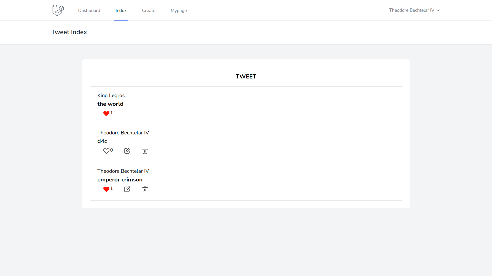

# Favorite 機能 2（各処理の実装）

データ連携の準備ができたので，各処理を実装していく．

## コントローラ生成

まずは，favorite 処理用のコントローラを作成する．

<!-- > 📦**Laravel コンテナ内の操作**
>
> ```bash
> $ docker-compose exec laravel.testbash
> root@8544d96d2334: /var/www/html #
> ``` -->

下記のコマンドを実行する．

```bash
$ php artisan make:controller FavoriteController --resource

# 実行結果
Controller created successfully.

```

## ルーティングの設定

続いてルーティングを設定する．

今回は`favorite`と`unfavorite`の URI を設定し，FavoriteController の`store()`関数と`destroy()`関数をそれぞれ利用する．

```php
// routes/web.php

<?php

use Illuminate\Support\Facades\Route;
use App\Http\Controllers\TweetController;

// 🔽 追加
use App\Http\Controllers\FavoriteController;

// 省略

Route::group(['middleware' => 'auth'], function () {
  // 🔽 追加
  Route::post('tweet/{tweet}/favorites', [FavoriteController::class, 'store'])->name('favorites');

  // 🔽 追加
  Route::post('tweet/{tweet}/unfavorites', [FavoriteController::class, 'destroy'])->name('unfavorites');

  Route::get('/tweet/mypage', [TweetController::class, 'mydata'])->name('tweet.mypage');
  Route::resource('tweet', TweetController::class);
});

Route::get('/', function () {
  return view('welcome');
});

Route::get('/dashboard', function () {
  return view('dashboard');
})->middleware(['auth'])->name('dashboard');

require __DIR__ . '/auth.php';

```

## コントローラの処理を実装

ルーティングで設定した`store()`関数と`destroy()`関数の中身を実装する．

`app/Http/Controllers/FavoriteController.php`を以下のように編集する．

`attach()`で中間テーブルへのデータの追加，`detach()`で中間テーブルからのデータ削除が実行される．

```php
// app/Http/Controllers/FavoriteController.php

<?php

namespace App\Http\Controllers;

use Illuminate\Http\Request;

// 🔽 2行追加
use App\Models\Tweet;
use Auth;

class FavoriteController extends Controller
{

  // 省略

  // 🔽 編集（`store()` の `()` 内も異なるので注意）
  public function store(Tweet $tweet)
  {
    $tweet->users()->attach(Auth::id());
    return redirect()->route('tweet.index');
  }

  // 🔽 編集（`destroy()` の `()` 内も異なるので注意）
  public function destroy(Tweet $tweet)
  {
    $tweet->users()->detach(Auth::id());
    return redirect()->route('tweet.index');
  }
}

```

## 一覧画面への反映

中間テーブルへのデータ追加及び削除の処理を実装したので，最後に favorite 数を一覧画面に反映させて完成となる．

まず，`$tweet->users()->where('user_id', Auth::id())->exists()`でログインしているユーザが favorite しているかどうかを判定する．

既 favorite の場合は unfavorite するボタンを，未 favorite の場合は favorite するボタンを条件分岐で表示する．

それぞれのボタン部分では favorite 件数を表示する．`$tweet->users()->count()` で中間テーブルのデータ件数を取得することができる．

```php
<!-- resources/views/tweet/index.blade.php -->

<x-app-layout>
  <x-slot name="header">
    <h2 class="font-semibold text-xl text-gray-800 leading-tight">
      {{ __('Tweet Index') }}
    </h2>
  </x-slot>

  <div class="py-12">
    <div class="max-w-7xl mx-auto sm:w-10/12 md:w-8/10 lg:w-8/12">
      <div class="bg-white overflow-hidden shadow-sm sm:rounded-lg">
        <div class="p-6 bg-white border-b border-gray-200">
          <table class="text-center w-full border-collapse">
            <thead>
              <tr>
                <th class="py-4 px-6 bg-grey-lightest font-bold uppercase text-lg text-grey-dark border-b border-grey-light">tweet</th>
              </tr>
            </thead>
            <tbody>
              @foreach ($tweets as $tweet)
              <tr class="hover:bg-grey-lighter">
                <td class="py-4 px-6 border-b border-grey-light">
                  <a href="{{ route('tweet.show',$tweet->id) }}">
                    <p class="text-left text-grey-dark">{{$tweet->user->name}}</p>
                    <h3 class="text-left font-bold text-lg text-grey-dark">{{$tweet->tweet}}</h3>
                  </a>
                  <div class="flex">
                    <!-- 🔽 追加 -->
                    <!-- favorite 状態で条件分岐 -->
                    @if($tweet->users()->where('user_id', Auth::id())->exists())
                    <!-- unfavorite ボタン -->
                    <form action="{{ route('unfavorites',$tweet) }}" method="POST" class="text-left">
                      @csrf
                      <button type="submit" class="flex mr-2 ml-2 text-sm hover:bg-gray-200 hover:shadow-none text-red py-1 px-2 focus:outline-none focus:shadow-outline">
                        <svg class="h-6 w-6 text-red-500" fill="red" viewBox="0 0 24 24" stroke="red">
                          <path stroke-linecap="round" stroke-linejoin="round" stroke-width="1" d="M4.318 6.318a4.5 4.5 0 000 6.364L12 20.364l7.682-7.682a4.5 4.5 0 00-6.364-6.364L12 7.636l-1.318-1.318a4.5 4.5 0 00-6.364 0z" />
                        </svg>
                        {{ $tweet->users()->count() }}
                      </button>
                    </form>
                    @else
                    <!-- favorite ボタン -->
                    <form action="{{ route('favorites',$tweet) }}" method="POST" class="text-left">
                      @csrf
                      <button type="submit" class="flex mr-2 ml-2 text-sm hover:bg-gray-200 hover:shadow-none text-black py-1 px-2 focus:outline-none focus:shadow-outline">
                        <svg class="h-6 w-6 text-red-500" fill="none" viewBox="0 0 24 24" stroke="black">
                          <path stroke-linecap="round" stroke-linejoin="round" stroke-width="1" d="M4.318 6.318a4.5 4.5 0 000 6.364L12 20.364l7.682-7.682a4.5 4.5 0 00-6.364-6.364L12 7.636l-1.318-1.318a4.5 4.5 0 00-6.364 0z" />
                        </svg>
                        {{ $tweet->users()->count() }}
                      </button>
                    </form>
                    @endif

                    @if ($tweet->user_id === Auth::user()->id)
                    <!-- 更新ボタン -->
                    <form action="{{ route('tweet.edit',$tweet->id) }}" method="GET" class="text-left">
                      @csrf
                      <button type="submit" class="mr-2 ml-2 text-sm hover:bg-gray-200 hover:shadow-none text-white py-1 px-2 focus:outline-none focus:shadow-outline">
                        <svg class="h-6 w-6 text-gray-500" fill="none" viewBox="0 0 24 24" stroke="black">
                          <path stroke-linecap="round" stroke-linejoin="round" stroke-width="1" d="M11 5H6a2 2 0 00-2 2v11a2 2 0 002 2h11a2 2 0 002-2v-5m-1.414-9.414a2 2 0 112.828 2.828L11.828 15H9v-2.828l8.586-8.586z" />
                        </svg>
                      </button>
                    </form>
                    <!-- 削除ボタン -->
                    <form action="{{ route('tweet.destroy',$tweet->id) }}" method="POST" class="text-left">
                      @method('delete')
                      @csrf
                      <button type="submit" class="mr-2 ml-2 text-sm hover:bg-gray-200 hover:shadow-none text-white py-1 px-2 focus:outline-none focus:shadow-outline">
                        <svg class="h-6 w-6 text-gray-500" fill="none" viewBox="0 0 24 24" stroke="black">
                          <path stroke-linecap="round" stroke-linejoin="round" stroke-width="1" d="M19 7l-.867 12.142A2 2 0 0116.138 21H7.862a2 2 0 01-1.995-1.858L5 7m5 4v6m4-6v6m1-10V4a1 1 0 00-1-1h-4a1 1 0 00-1 1v3M4 7h16" />
                        </svg>
                      </button>
                    </form>
                    @endif
                  </div>
                </td>
              </tr>
              @endforeach
            </tbody>
          </table>
        </div>
      </div>
    </div>
  </div>
</x-app-layout>

```

## 動作確認

下図のように favorite ボタンが表示され，favorite 件数が表示されていれば OK．

ここまでで Twitter ライクな SNS アプリケーションの実装は完了である．


