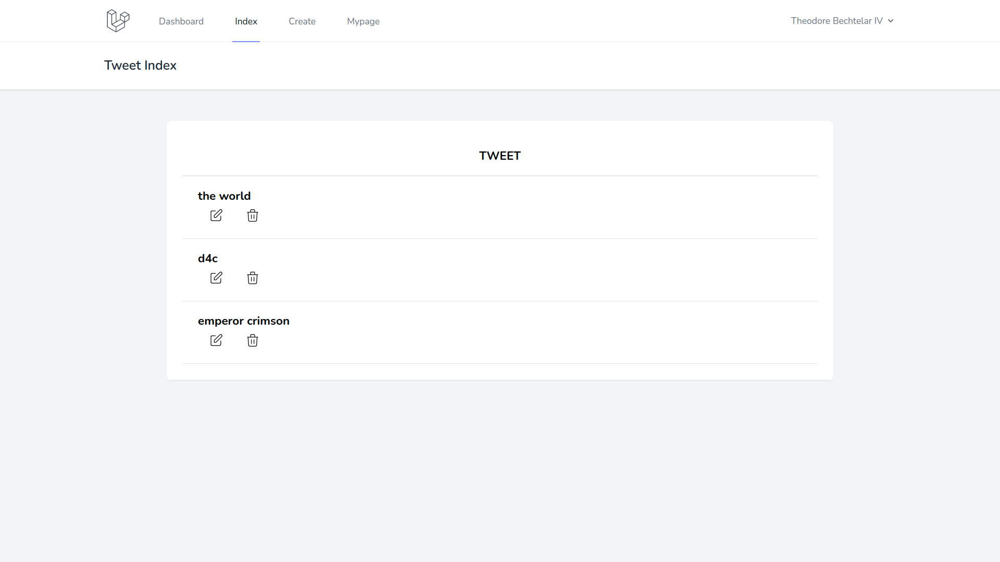
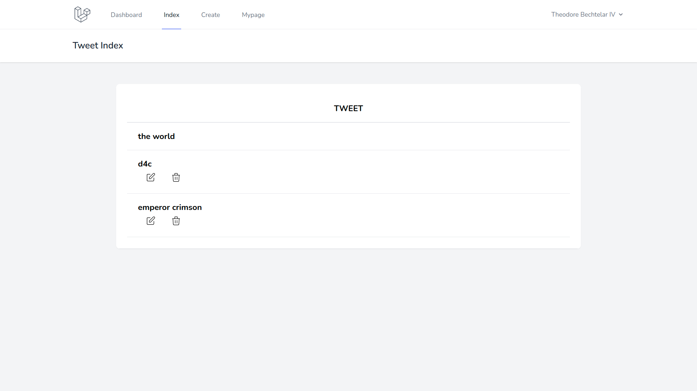

# マイページ機能の実装（1 対多のデータ）

現在，一覧ページにはユーザ関係なく全てのデータが表示された状態となっている．ユーザが自分の投稿を確認して編集できるように，マイページ機能を実装する．

## 1 対多のデータ連携

今回の場合，ユーザと tweet が「1 対多」の関係となっている．

Laravel では，このような場合に親となるデータから子のデータを取得する方法が準備されている．

`app/Models/User.php`に以下のように編集する．

```php
// app/Http/Models/User.php

class User extends Authenticatable
{
  use HasApiTokens, HasFactory, Notifiable;

  // 省略

  // 🔽 追加
  public function mytweets()
  {
    return $this->hasMany(Tweet::class)->orderBy('updated_at', 'desc');
  }
}

```

ここで，User と Tweet を連携させるためには，子（Tweet）のカラムに「`親_id`」（<- 今回は`user_id`）を用意しておく必要がある（前項で実施）．

これで`User`モデルを用いて，特定のユーザが投稿した tweet を取得できるようになる．

## マイページのルーティング

マイページを表示するためのルーティングを追加する．

`routes/web.php`を以下のように編集する．

```php
// routes/web.php

<?php

use Illuminate\Support\Facades\Route;
use App\Http\Controllers\TweetController;

Route::group(['middleware' => 'auth'], function () {
  // 🔽 追加
  Route::get('/tweet/mypage', [TweetController::class, 'mydata'])->name('tweet.mypage');
  Route::resource('tweet', TweetController::class);
});

Route::get('/', function () {
  return view('welcome');
});

Route::get('/dashboard', function () {
  return view('dashboard');
})->middleware(['auth'])->name('dashboard');

require __DIR__ . '/auth.php';

```

## 特定ユーザのデータのみ取得する処理

`app/Http/Controllers/TweetController.php`の`index()`を内容を以下のように編集する．

`class TweetController extends Controller{ ... }`内の最後に`mydata()`関数を追加すれば OK．

```php
// app/Http/Controllers/TweetController.php

<?php

namespace App\Http\Controllers;

use Illuminate\Http\Request;
use Validator;
use App\Models\Tweet;
use Auth;

// 🔽 追加
use App\Models\User;

class TweetController extends Controller
{

  // 省略

  public function mydata()
  {
    // Userモデルに定義した関数を実行する．
    $tweets = User::find(Auth::user()->id)->mytweets;
    return view('tweet.index', [
      'tweets' => $tweets
    ]);
  }
}

```

## マイページ画面の確認

マイページ自体は`index.blade.php`画面をそのまま利用するため，新たに実装する必要はない（ビューファイルにログインユーザのデータのみ渡される）．

スムーズにマイページにアクセスできるようにするため，ナビゲーション部分にリンクを追加する．

`resources/views/layouts/navigation.blade.php`の内容を以下のように編集する．

長いので全コピペ推奨．

```php
<!-- resources/views/layouts/navigation.blade.php -->

<nav x-data="{ open: false }" class="bg-white border-b border-gray-100">
  <!-- Primary Navigation Menu -->
  <div class="max-w-7xl mx-auto px-4 sm:px-6 lg:px-8">
    <div class="flex justify-between h-16">
      <div class="flex">
        <!-- Logo -->
        <div class="flex-shrink-0 flex items-center">
          <a href="{{ route('dashboard') }}">
            <x-application-logo class="block h-10 w-auto fill-current text-gray-600" />
          </a>
        </div>

        <!-- Navigation Links -->
        <div class="hidden space-x-8 sm:-my-px sm:ml-10 sm:flex">
          <x-nav-link :href="route('dashboard')" :active="request()->routeIs('dashboard')">
            {{ __('Dashboard') }}
          </x-nav-link>
        </div>
        <!-- 🔽 一覧ページへのリンクを追加 -->
        <div class="hidden space-x-8 sm:-my-px sm:ml-10 sm:flex">
          <x-nav-link :href="route('tweet.index')" :active="request()->routeIs('tweet.index')">
            {{ __('Index') }}
          </x-nav-link>
        </div>
        <!-- 🔽 作成ページへのリンクを追加 -->
        <div class="hidden space-x-8 sm:-my-px sm:ml-10 sm:flex">
          <x-nav-link :href="route('tweet.create')" :active="request()->routeIs('tweet.create')">
            {{ __('Create') }}
          </x-nav-link>
        </div>
        <!-- 🔽 マイページへのリンクを追加 -->
        <div class="hidden space-x-8 sm:-my-px sm:ml-10 sm:flex">
          <x-nav-link :href="route('tweet.mypage')" :active="request()->routeIs('tweet.mypage')">
            {{ __('Mypage') }}
          </x-nav-link>
        </div>
      </div>

      <!-- Settings Dropdown -->
      <div class="hidden sm:flex sm:items-center sm:ml-6">
        <x-dropdown align="right" width="48">
          <x-slot name="trigger">
            <button class="flex items-center text-sm font-medium text-gray-500 hover:text-gray-700 hover:border-gray-300 focus:outline-none focus:text-gray-700 focus:border-gray-300 transition duration-150 ease-in-out">
              <div>{{ Auth::user()->name }}</div>

              <div class="ml-1">
                <svg class="fill-current h-4 w-4" xmlns="http://www.w3.org/2000/svg" viewBox="0 0 20 20">
                  <path fill-rule="evenodd" d="M5.293 7.293a1 1 0 011.414 0L10 10.586l3.293-3.293a1 1 0 111.414 1.414l-4 4a1 1 0 01-1.414 0l-4-4a1 1 0 010-1.414z" clip-rule="evenodd" />
                </svg>
              </div>
            </button>
          </x-slot>

          <x-slot name="content">
            <!-- Authentication -->
            <form method="POST" action="{{ route('logout') }}">
              @csrf

              <x-dropdown-link :href="route('logout')" onclick="event.preventDefault();
                                                this.closest('form').submit();">
                {{ __('Logout') }}
              </x-dropdown-link>
            </form>
          </x-slot>
        </x-dropdown>
      </div>

      <!-- Hamburger -->
      <div class="-mr-2 flex items-center sm:hidden">
        <button @click="open = ! open" class="inline-flex items-center justify-center p-2 rounded-md text-gray-400 hover:text-gray-500 hover:bg-gray-100 focus:outline-none focus:bg-gray-100 focus:text-gray-500 transition duration-150 ease-in-out">
          <svg class="h-6 w-6" stroke="currentColor" fill="none" viewBox="0 0 24 24">
            <path :class="{'hidden': open, 'inline-flex': ! open }" class="inline-flex" stroke-linecap="round" stroke-linejoin="round" stroke-width="2" d="M4 6h16M4 12h16M4 18h16" />
            <path :class="{'hidden': ! open, 'inline-flex': open }" class="hidden" stroke-linecap="round" stroke-linejoin="round" stroke-width="2" d="M6 18L18 6M6 6l12 12" />
          </svg>
        </button>
      </div>
    </div>
  </div>

  <!-- Responsive Navigation Menu -->
  <div :class="{'block': open, 'hidden': ! open}" class="hidden sm:hidden">
    <div class="pt-2 pb-3 space-y-1">
      <x-responsive-nav-link :href="route('dashboard')" :active="request()->routeIs('dashboard')">
        {{ __('Dashboard') }}
      </x-responsive-nav-link>
    </div>
    <!-- 🔽 一覧ページへのリンクを追加 -->
    <div class="pt-2 pb-3 space-y-1">
      <x-responsive-nav-link :href="route('tweet.index')" :active="request()->routeIs('tweet.index')">
        {{ __('Index') }}
      </x-responsive-nav-link>
    </div>
    <!-- 🔽 作成ページへのリンクを追加 -->
    <div class="pt-2 pb-3 space-y-1">
      <x-responsive-nav-link :href="route('tweet.create')" :active="request()->routeIs('tweet.create')">
        {{ __('Create') }}
      </x-responsive-nav-link>
    </div>
    <!-- 🔽 マイページへのリンクを追加 -->
    <div class="pt-2 pb-3 space-y-1">
      <x-responsive-nav-link :href="route('tweet.mypage')" :active="request()->routeIs('tweet.mypage')">
        {{ __('Mypage') }}
      </x-responsive-nav-link>
    </div>

    <!-- Responsive Settings Options -->
    <div class="pt-4 pb-1 border-t border-gray-200">
      <div class="flex items-center px-4">
        <div class="flex-shrink-0">
          <svg class="h-10 w-10 fill-current text-gray-400" xmlns="http://www.w3.org/2000/svg" fill="none" viewBox="0 0 24 24" stroke="currentColor">
            <path stroke-linecap="round" stroke-linejoin="round" stroke-width="2" d="M16 7a4 4 0 11-8 0 4 4 0 018 0zM12 14a7 7 0 00-7 7h14a7 7 0 00-7-7z" />
          </svg>
        </div>

        <div class="ml-3">
          <div class="font-medium text-base text-gray-800">{{ Auth::user()->name }}</div>
          <div class="font-medium text-sm text-gray-500">{{ Auth::user()->email }}</div>
        </div>
      </div>

      <div class="mt-3 space-y-1">
        <!-- Authentication -->
        <form method="POST" action="{{ route('logout') }}">
          @csrf

          <x-responsive-nav-link :href="route('logout')" onclick="event.preventDefault();
                                        this.closest('form').submit();">
            {{ __('Logout') }}
          </x-responsive-nav-link>
        </form>
      </div>
    </div>
  </div>
</nav>

```

## tweet データの編集

phpmyadmin で tweets テーブルのデータを確認し，レコード毎に`user_id`が異なるよう調整しておく．

## 動作確認（マイページ）

下図のようにマイページへのリンクが表示される．



マイページを表示させ，ログインしているユーザのデータのみ表示されることを確認する．異なるユーザでログインし，個別にデータが表示されることを確認しても良いだろう．


## 一覧ページでログインユーザの投稿のみ編集削除できるようにする

現状，一覧ページでは全ての投稿に対して編集や削除が行える状態である．これを下記のようにしたい．

- ログインしているユーザは自分の投稿を編集削除できる．
- 自分以外のユーザの投稿は閲覧のみ可能．

一覧画面のビューファイル内で条件分岐を行い，編集ボタンと削除ボタンの表示非表示を制御することで実現できる．

`resources/views/tweet/index.blade.php`を以下のように編集する．

```php
<!-- resources/views/tweet/index.blade.php -->

<x-app-layout>
  <x-slot name="header">
    <h2 class="font-semibold text-xl text-gray-800 leading-tight">
      {{ __('Tweet Index') }}
    </h2>
  </x-slot>

  <div class="py-12">
    <div class="max-w-7xl mx-auto sm:w-10/12 md:w-8/10 lg:w-8/12">
      <div class="bg-white overflow-hidden shadow-sm sm:rounded-lg">
        <div class="p-6 bg-white border-b border-gray-200">
          <table class="text-center w-full border-collapse">
            <thead>
              <tr>
                <th class="py-4 px-6 bg-grey-lightest font-bold uppercase text-lg text-grey-dark border-b border-grey-light">tweet</th>
              </tr>
            </thead>
            <tbody>
              @foreach ($tweets as $tweet)
              <tr class="hover:bg-grey-lighter">
                <td class="py-4 px-6 border-b border-grey-light">
                  <a href="{{ route('tweet.show',$tweet->id) }}">
                    <h3 class="text-left font-bold text-lg text-grey-dark">{{$tweet->tweet}}</h3>
                  </a>
                  <div class="flex">
                    <!-- 🔽 条件分岐でログインしているユーザが投稿したtweetのみ編集ボタンと削除ボタンが表示される -->
                    @if ($tweet->user_id === Auth::user()->id)
                    <!-- 更新ボタン -->
                    <form action="{{ route('tweet.edit',$tweet->id) }}" method="GET" class="text-left">
                      @csrf
                      <button type="submit" class="mr-2 ml-2 text-sm hover:bg-gray-200 hover:shadow-none text-white py-1 px-2 focus:outline-none focus:shadow-outline">
                        <svg class="h-6 w-6 text-gray-500" fill="none" viewBox="0 0 24 24" stroke="black">
                          <path stroke-linecap="round" stroke-linejoin="round" stroke-width="1" d="M11 5H6a2 2 0 00-2 2v11a2 2 0 002 2h11a2 2 0 002-2v-5m-1.414-9.414a2 2 0 112.828 2.828L11.828 15H9v-2.828l8.586-8.586z" />
                        </svg>
                      </button>
                    </form>
                    <!-- 削除ボタン -->
                    <form action="{{ route('tweet.destroy',$tweet->id) }}" method="POST" class="text-left">
                      @method('delete')
                      @csrf
                      <button type="submit" class="mr-2 ml-2 text-sm hover:bg-gray-200 hover:shadow-none text-white py-1 px-2 focus:outline-none focus:shadow-outline">
                        <svg class="h-6 w-6 text-gray-500" fill="none" viewBox="0 0 24 24" stroke="black">
                          <path stroke-linecap="round" stroke-linejoin="round" stroke-width="1" d="M19 7l-.867 12.142A2 2 0 0116.138 21H7.862a2 2 0 01-1.995-1.858L5 7m5 4v6m4-6v6m1-10V4a1 1 0 00-1-1h-4a1 1 0 00-1 1v3M4 7h16" />
                        </svg>
                      </button>
                    </form>
                    @endif
                  </div>
                </td>
              </tr>
              @endforeach
            </tbody>
          </table>
        </div>
      </div>
    </div>
  </div>
</x-app-layout>

```

## 動作確認（編集削除ボタンの表示非表示）

自分の投稿のみ編集ボタンと削除ボタンが表示されれば OK！

phpmyadmin で `user_id` カラムを適当に編集しながら確認すると良いだろう．


