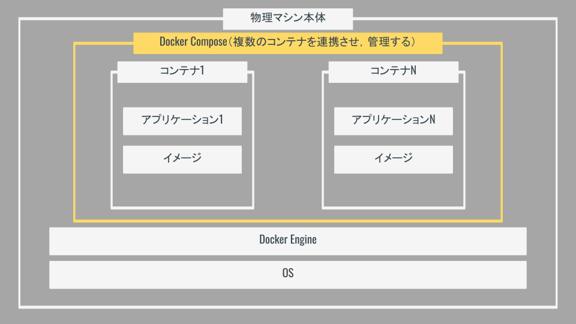

# 【補足】Docker と Docker Compose の解説

## Docker とは

コンテナ型の仮想化技術を提供するプロダクト．

## 「仮想化」とは

物理的な PC やサーバ上に仮想的なマシンを動かすこと．

仮想化を用いる利点としては下記が挙げられる．

- 異なるコンピュータ間でも同じ環境を用意できる．
- コンピュータ内の状況に依らず，開発や運用をおこなうことができる（仮想マシン同士は独立に動作する）．
- 不具合があった場合にもすぐに環境を作り直すことができる．

反面，デメリットとしては下記が挙げられる．

- コンピュータ上でマシンを複数台動作させている状況なので，リソースを圧迫する．
- それなりのマシンスペックが求められる．
- 仮想マシンを共有する場合にファイルが重い．

↓ 仮想マシンの大雑把な仕組み

## 「コンテナ型」とは

通常の仮想化が「仮想マシン」を OS レベルから構成していたのに対し，コンテナ型の場合は Docker が OS などの環境を準備してくれる．

そのため，通常の仮想化よりも

- 軽量であるため，複数のコンテナを同時に動作させることもできる．各コンテナは独立に動作し，お互いに影響しない．
- Docker さえ準備しておけば，「Dockerfile」という設定ファイルを共有することで簡単に環境を再現可能．

などの利点がある．

これにより，Docker では複雑なアーキテクチャを持つプロダクトであっても簡単に複数のマシンで実行環境を共有できる．

↓ コンテナの大雑把な仕組み

## コンテナの仕組み

コンテナは以下の要素から作られている．

- Application
- Image

### Application とは

実際にコンテナ内で開発，動作させるアプリケーション．今回は Laravel がこれに当たり，開発しているときは個々の部分のコードを書くこととなる．

### Image とは

イメージは「仮想マシンの構成を定義するもの」で，アプリケーションを動作させるために必要なもの（OS，言語，など）を用意する．「Docker Image」と呼ばれ，オンライン上の「DockerHub」からダウンロードして用いることができる．

また，用意する OS 上で任意のコマンドなど実行してライブラリ等インストールしたい場合は「Dockerfile」と呼ばれる設定ファイルにその旨を記述する．

イメージは「環境」であるため一度作成されたら編集は不可能．

## コンテナの問題点

コンテナを用意するときは，「1 コンテナ 1 役割」で用意する．

そのため，アプリケーションを開発する際には複数のコンテナが必要になることが多い．

例：

- Web サーバ用コンテナ
- アプリケーションサーバ用コンテナ
- DB サーバ用コンテナ

しかし，コンテナ数が多くなると管理が面倒な上，「各コンテナは独立に動作し，お互いに影響しない」ため，実行順などによってはうまく連携しない場合も発生する．

## Docker Compose とは

Docker Compose は上記のような場合に「複数のコンテナを連携させて管理・運用するプロダクト」である．

連携させるコンテナの情報は「`Docker-compose.yaml`」ファイルに記述する．

`Docker-compose.yaml` はインデントによってデータ構成を表すため，不用意にインデントを崩さないよう注意する．

まずは「ファイル内の `services` 直下部分がコンテナを表す」を押さえておけば OK．

↓ Docker compose のイメージ

