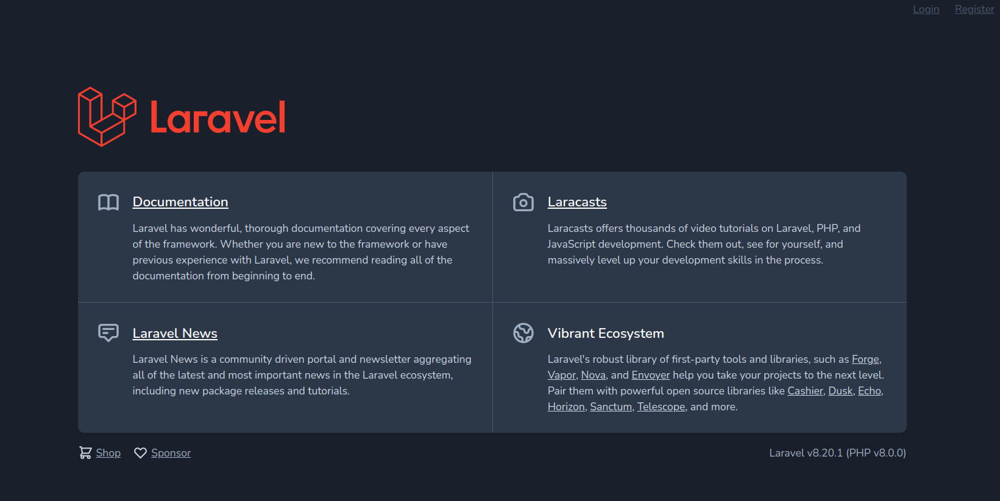

# ライブラリ準備

## ライブラリ準備

作成するアプリケーションでライブラリを使用する場合はコマンドでインストールを行う．今回は認証を実装するための`Laravel Breeze`をインストールする．

<!-- Laravel のプロジェクト内でコマンドを実行する場合には，下記コマンドで仮想コンテナにログインする必要がある．

```bash
$ docker-compose exec laravel.test bash
root@81f8517c4e7f:/var/www/html#
```

仮想コンテナから出る場合には下記のコマンドを実行する．

```bash
root@81f8517c4e7f:/var/www/html# exit
exit
$
```

**以降のコマンドは仮想コンテナにログインした状態（ターミナルが`/var/www/html# `になっている状態）で行うこと** -->

**まず，作成したアプリケーションのディレクトリ（laratter ディレクトリ）に移動しておく．**

```bash
$ cd laratter
```

> **💡 Key Point**
>
> **Laravel アプリケーションに対してコマンドを実行する場合にはアプリケーションのディレクトリ内でコマンドを実行する．**

下記コマンドを実行し，必要なファイルをダウンロードする．

```bash
$ composer require laravel/breeze --dev
```

実行結果

```bash
...
Discovered Package: nesbot/carbon
Discovered Package: nunomaduro/collision
Package manifest generated successfully.
73 packages you are using are looking for funding.
Use the `composer fund` command to find out more!
```

下記コマンドでインストールする．

```bash
$ php artisan breeze:install
```

実行結果

```bash
Breeze scaffolding installed successfully.
Please execute the "npm install && npm run dev" command to build your assets.
```

下記コマンドを実行し，その他必要なパッケージをインストールしてビルドする（ここで Node.js が動く）．

```bash
$ npm install && npm run dev
```

実行結果（やや時間がかかる）

```bash
✔ Compiled Successfully in 4720ms
┌───────────────────────────────────────────────────────────────────┬──────────┐
│                                                              File │ Size     │
├───────────────────────────────────────────────────────────────────┼──────────┤
│                                                        /js/app.js │ 673 KiB  │
│                                                       css/app.css │ 3.82 MiB │
└───────────────────────────────────────────────────────────────────┴──────────┘
webpack compiled successfully
```

ブラウザで localhost にアクセスし，動作を確認する．

以下の画面が表示されれば OK（右上に`Login`と`register`が表示される）．



右上の`register`をクリックするとユーザ登録画面に移動するが，まだこの段階ではユーザ登録機能は動作しない．ユーザ登録画面が表示されれば OK．


ここまででライブラリの準備は完了．
