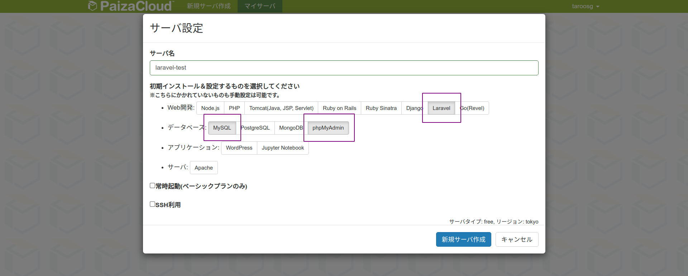
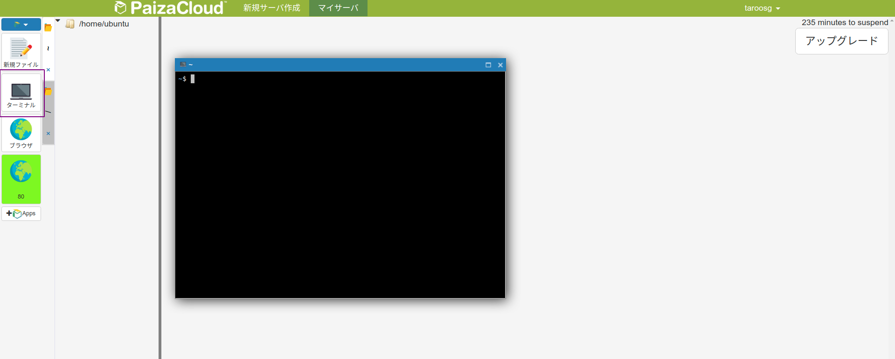
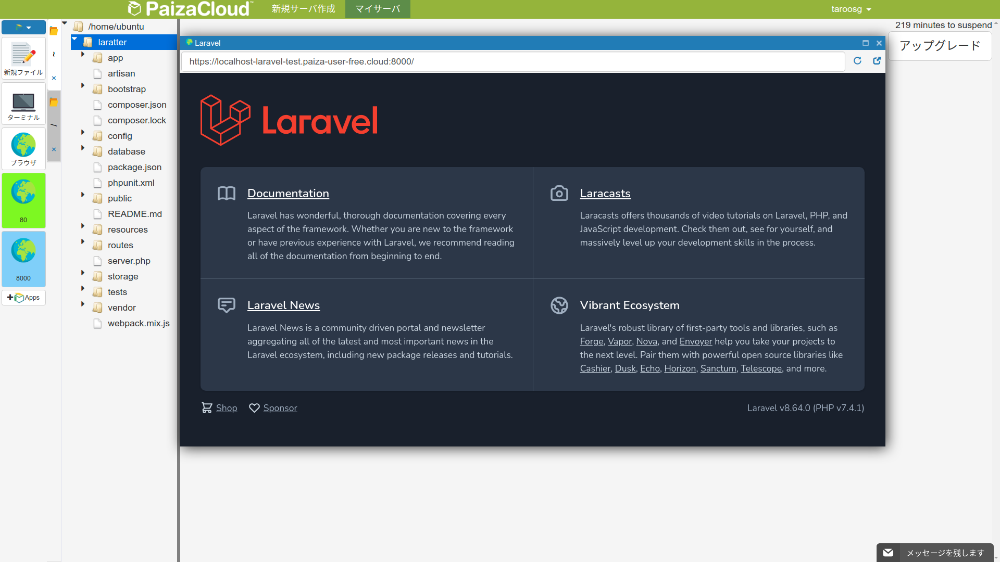
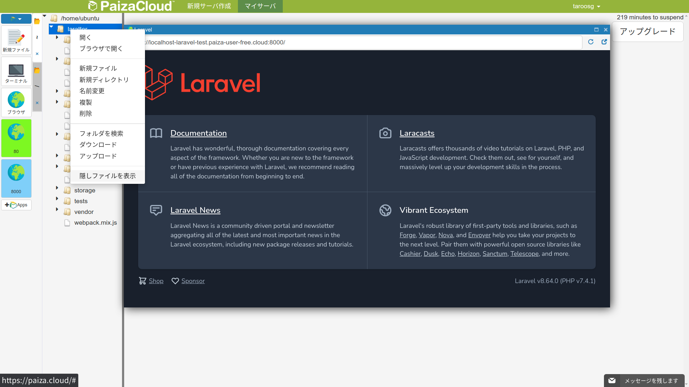
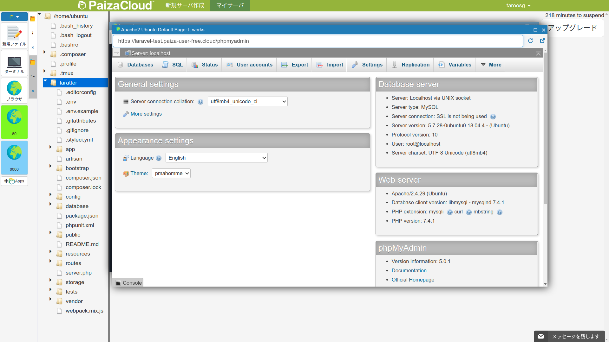
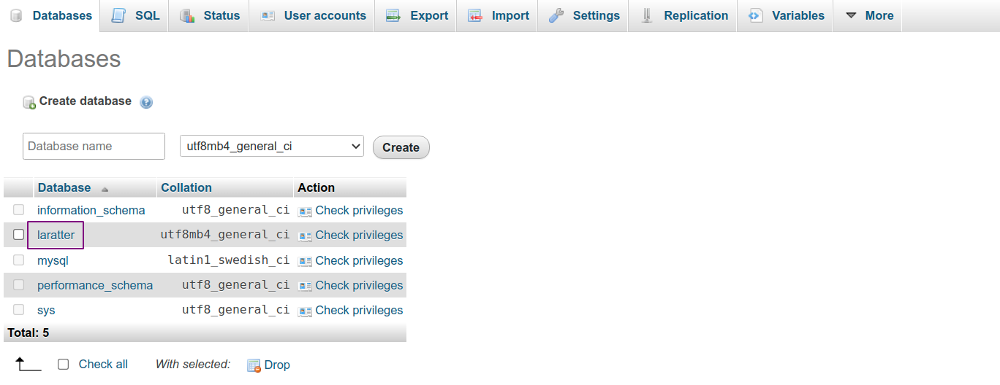

# 【Paiza Cloud 編】環境構築

一連の講義では，PHP のフレームワークである Laravel を用いて twitter 風の SNS アプリケーション「Laratter」を実装しながら，Web アプリケーションにおける基本的な処理をマスターする．

## Paiza Cloud 上に Laravel 環境を準備

下記の URL にアクセスする．

[https://paiza.cloud/ja/](https://paiza.cloud/ja/)

ログインする．アカウントなければ適当に作成する．

ログインしたら「新規サーバ作成」をクリック．

- 名前は適当につける．
- Laravel，MySQL，phpmyadmin を選択する．
- サーバ作成ボタンクリックしてサーバの準備は完了．



## Laravel プロジェクトの作成

左側のターミナルをクリックしてターミナルを起動する．



下記コマンドを実行して Laravel のプロジェクトを作成する．

```bash
$ composer create-project laravel/laravel laratter --prefer-dist
```

完了したら下記コマンドを実行する．

```bash
$ cd laratter
$ php artisan serve

# 実行結果
Starting Laravel development server: http://127.0.0.1:8000

```

左側の「8000」をクリックして Laravel のアプリケーションを立ち上げる．

下記の画面が表示されれば OK！



サーバを終了するときは「ctrl + c」を入力する．

## 隠しファイルの表示

適当なフォルダ上で右クリックし，「隠しファイルを表示」をクリックする．



## Git

バージョンが古いので最新にしておく．

```bash
# Git リポジトリの追加
$ sudo add-apt-repository ppa:git-core/ppa

# 実行結果（中略）
The most current stable version of Git for Ubuntu.
...
W: Some index files failed to download. They have been ignored, or old ones used instead.

# パッケージのアップデート
$ sudo apt update

# 実行結果（中略）
Hit:1 http://ap-northeast-1.ec2.archive.ubuntu.com/ubuntu bionic InRelease
Hit:2 http://ap-northeast-1.ec2.archive.ubuntu.com/ubuntu bionic-updates InRelease
...
W: Some index files failed to download. They have been ignored, or old ones used instead.

# Git のインストール
$ sudo apt install git

# 実行結果（中略）
Reading package lists... Done
Building dependency tree
Reading state information... Done
...
Setting up git (1:2.33.1-0ppa1~ubuntu18.04.1) ...
Processing triggers for man-db (2.8.3-2ubuntu0.1) ...

# バージョン確認
$ git --version

# 実行結果
git version 2.33.1

```

## phpmyadmin

左側の「80」をクリックし，アドレスバーに `/phpmyadmin` を追加して Enter．

下記画面が表示されれば OK！



## DB の作成

phpmyadmin 画面からデータベースを作成する．

Laravel ではテーブル作成は「マイグレーション」という仕組みを使用する（後述）ので，DB のみ準備しておけば OK．

phpmyadmin 画面の SQL タブをクリックし，下記の SQL を実行する．

```sql
CREATE DATABASE laratter;
```

Databases タブをクリックし，laratter データベースが作成されていれば OK！



## Laravel から DB に接続するための設定

続いて，Laravel から MySQL にアクセスするための設定を行う．

エディタから`.env`ファイルを開く．`.env`ファイルは`laratter`ディレクトリの直下に配置されている．

10 行目から 15 行目を以下のように編集する．

```env
DB_CONNECTION=mysql
DB_HOST=127.0.0.1
DB_PORT=3306
DB_DATABASE=laratter
DB_USERNAME=root
DB_PASSWORD=

```

それぞれ下記の意味となっている．デプロイする場合などはサービス提供者側からそれぞれ情報が提供されるため，必要に応じて編集する．

| 項目          | 意味                              |
| ------------- | --------------------------------- |
| DB_CONNECTION | DB の種類                         |
| DB_HOST       | DB のホスト名                     |
| DB_PORT       | DB のポート                       |
| DB_DATABASE   | DB 名                             |
| DB_USERNAME   | DB にログインするときのユーザ名   |
| DB_PASSWORD   | DB にログインするときのパスワード |

もし`.env`ファイルを更新する場合はキャッシュをクリアする．

> 設定ファイルはサーバ起動時にキャッシュに保存されるため，変更した場合は「キャッシュをクリアする」「コンテナを立ち上げ直す」のどちらかが必要になる．
>
> キャッシュクリアのコマンドを実行する場合は Laravel の仮想コンテナにログインした状態で行うこと．

```bash
$ php artisan config:cache
```

実行結果

```bash
Configuration cache cleared!
Configuration cached successfully!
```

## HTTPS 設定の追加

Paiza Cloud 上では常に https で通信が行われる．そのため，Laravel 側でも同様の設定をしておかないとうまく動かない．

`app/Providers/AppServiceProvider.php` を以下のように編集する．

```php
<?php

namespace App\Providers;

use Illuminate\Support\ServiceProvider;
// 🔽 1行追加 🔽
use Illuminate\Routing\UrlGenerator;

class AppServiceProvider extends ServiceProvider
{
  /**
   * Register any application services.
   *
   * @return void
   */
  public function register()
  {
    //
  }

  /**
   * Bootstrap any application services.
   *
   * @return void
   */
  // 🔽 編集 🔽
  public function boot(UrlGenerator $url)
  {
    $url->forceScheme('https');
  }
}

```
