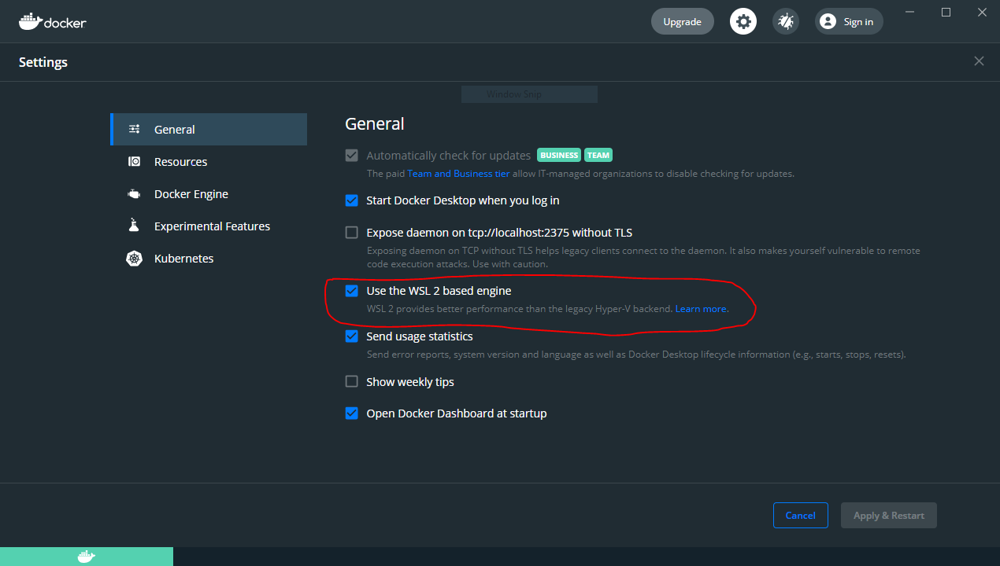

# 【Windows 編】環境構築

Docker を使用するための準備を進めていく．

必要なもの

- Docker Desktop
- Windows ターミナル
- Ubuntu 20.04
- WSL2
- PowerShell（Windows にもともと入っている）

## Docker Desktop のダウンロードとインストール

下記の URL にアクセスし，必要なファイルをダウンロードする．

[https://hub.docker.com/editions/community/docker-ce-desktop-windows/](https://hub.docker.com/editions/community/docker-ce-desktop-windows/)

1. `Docker Desktop Installer.exe` をダブルクリックし，インストーラを起動する．

2. 確認画面が出たら， `Enable Hyper-V Windows Features` （Hyper V の Windows 機能を有効にする）のオプションが，設定ページで選択されているかどうかを確認する．OS の状況によっては出てこない場合もあるので，その場合もそのまま進める．

3. インストール・ウィザードの指示に従い，利用規約（ライセンス）を承諾し，インストーラに権限を与えてインストールを進める．

4. インストールに成功したら， `Close` （閉じる）をクリックしてインストールを終了する．

## Windows ターミナルと Ubuntu 20.04 のインストール

以下の URL からそれぞれをインストールする．

- [Windows ターミナル（https://www.microsoft.com/ja-jp/p/windows-terminal/9n0dx20hk701）](https://www.microsoft.com/ja-jp/p/windows-terminal/9n0dx20hk701)
- [Ubuntu 20.04（https://www.microsoft.com/ja-jp/p/ubuntu-2004-lts/9n6svws3rx71）](https://www.microsoft.com/ja-jp/p/ubuntu-2004-lts/9n6svws3rx71)

## WSL2 のダウンロード，インストールと設定

1. 下記の URL から必要なファイルをダウンロードする．

[https://wslstorestorage.blob.core.windows.net/wslblob/wsl_update_x64.msi](https://wslstorestorage.blob.core.windows.net/wslblob/wsl_update_x64.msi)

> 注意
>
> ARM64 マシンを使用している場合は，代わりに[https://wslstorestorage.blob.core.windows.net/wslblob/wsl_update_arm64.msi](https://wslstorestorage.blob.core.windows.net/wslblob/wsl_update_arm64.msi)をダウンロードする．

2. ダウンロードしたファイルをダブルクリックして実行する．管理者特権のアクセス許可を求めるメッセージが表示される．`はい` を選択して，インストールを進める．

3. PowerShell を開いて次のコマンドを実行し，新しい Linux ディストリビューションをインストールする際の既定のバージョンとして WSL 2 を設定する．

```bash
wsl --set-default-version 2
```

<!-- 1. 下記の URL の「Step 4」と「Step 5」を実行する．
    - [https://docs.microsoft.com/en-us/windows/wsl/install-manual#step-4---download-the-linux-kernel-update-package](https://docs.microsoft.com/en-us/windows/wsl/install-manual#step-4---download-the-linux-kernel-update-package) -->

4. PC を再起動する．

## Docker の動作確認

1. Docker Desktop を起動する．

2. 「`Setting`（画面上部の ⚙ アイコン）」 -> 「`General`」 -> 「`Use the WSL2 based engine`」にチェックを入れる．すでにチェックが入っていてユーザが操作できない状態となっている場合があるが，その場合はそのままで OK．



3. 「`Setting`（画面上部の ⚙ アイコン）」 -> 「`Resources`」 -> 「`WSL INTEGRATION`」の `Enable Integration ...` にチェックを入れ，「`Ubuntu 20.04`」のトグルをオンにする．

- トグルが出てこない場合は PC を再起動する．
- 再起動してもダメなら以下の手順を試す．
  - Windows のスタートメニューをクリックして「Ubuntu」と入力し，Ubuntu を起動する．
  - ターミナルのような画面でユーザ名を設定するよう表示されるので，任意のユーザ名を入力する．
  - 続けて，パスワードを設定する．
  - 設定が終了したら `exit` を入力 →Enter して Ubuntu を終了する．
  - PowerShell を管理者モードで起動し，`wsl --set-default-version 2` のコマンドを実行する．
  - PC を再起動し，Docker Desktop の設定項目を確認する．


4. Windows ターミナルを Ubuntu 20.04 で動かす．

↓ Windows ターミナルを開いて上部の「∨」をクリックするとメニューが出るので，ここで `Ubuntu 20.04` を選ぶ．出てこない場合は PC を再起動する．


↓ このようになっていればコマンドが実行できる．**次項以降もこの状態でコマンドを実行していく．**


5. 下記のコマンドを実行し， `docker` のバージョンが表示されれば準備完了（バージョンなどの数値は資料より新しくて問題ない）．

```bash
$ docker -v
Docker version 20.10.8, build 3967b7d

```

バージョンが表示されたら，「Laravel プロジェクト作成」項に進もう！
